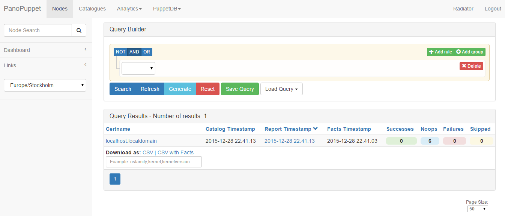
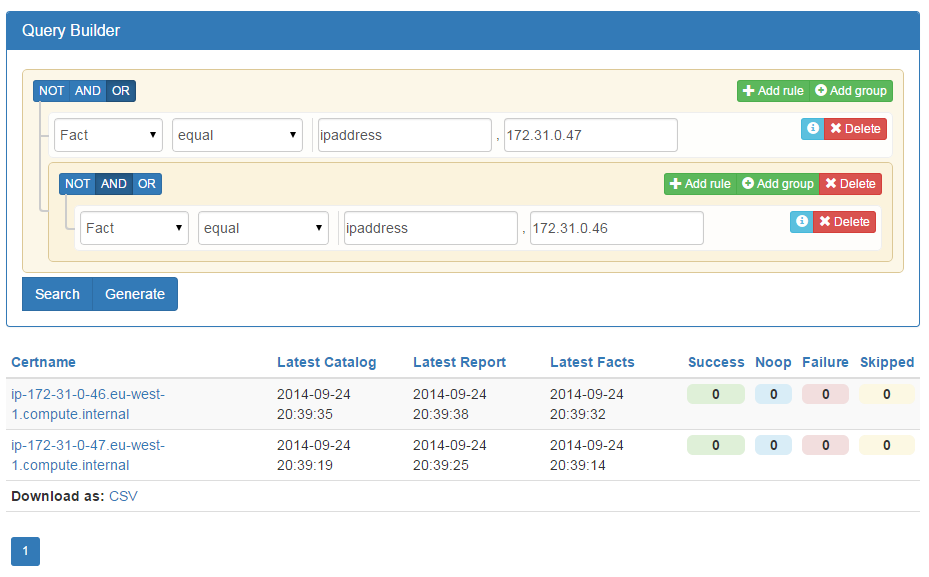
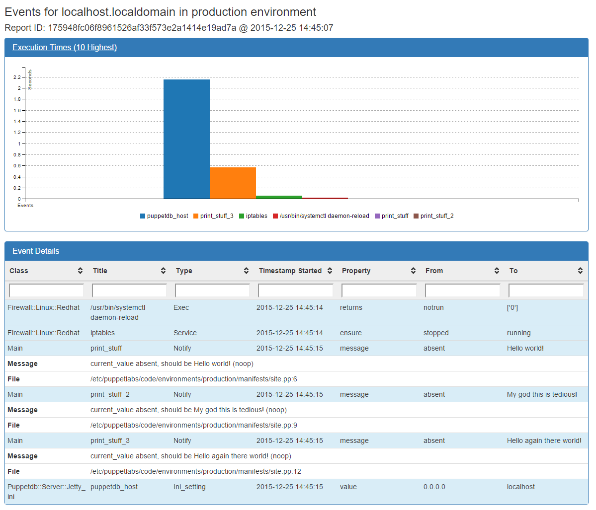
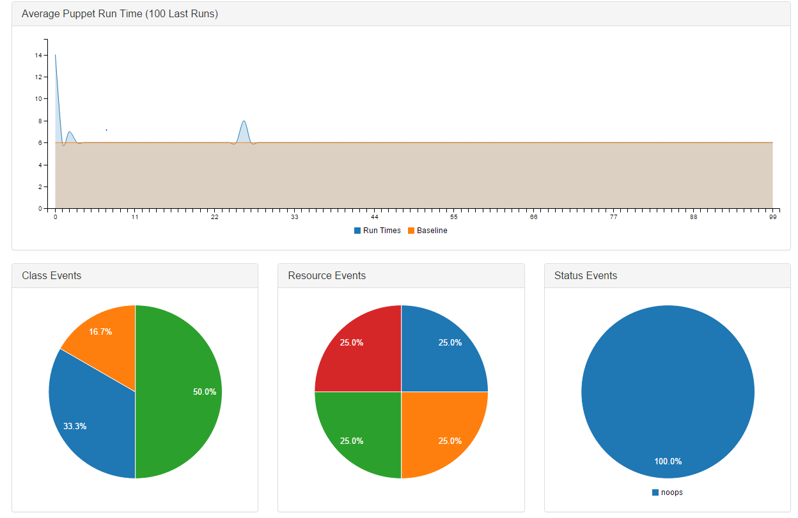
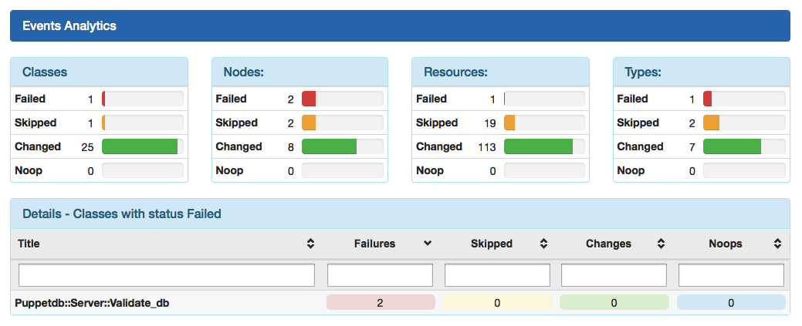

# PanoPuppet
PanoPuppet is still under development so be prepared for big changes.
All config will be taken from a specific file. There will be a example config file
you can work from, but remember that when upgrading to a new version panopuppet may
break and you will need to follow the instructions specified in the upgrade section
of this readme.

While panopuppet is very stable there may be a few bugs here and there. I appreciate any
Pull Requests or Issues created for me to take a look at. While there are no tests today
to verify functionality, I am working on creating tests for verification.

Thank you for taking your time to try PanoPuppet.

**Table of Contents**

- [PanoPuppet](#panopuppet)
- [Features](#features)
- [Requirements](#requirements)
- [Notes about puppetv4](#notes-about-puppetv4)
- [Future plans](#future-plans)
- [Introduction](#introduction)
- [Issues](#issues)
  - [QueryBuilder](#querybuilder)
  - [About the code](#about-the-code)
- [Screenshots](#screenshots)
  - [Login Page](#login-page)
  - [Dashboard - Recent Tab is the default view](#dashboard---recent-tab-is-the-default-view)
  - [Nodes View](#nodes-view)
  - [Nodes Search](#nodes-search)
  - [Nodes Reports](#nodes-reports)
  - [Nodes Report Events](#nodes-report-events)
  - [Node Report Events Execution Times](#node-report-events-execution-times)
  - [Latest Run Graphs](#latest-run-graphs)
  - [Events Analytics](#events-analytics)
- [Installation](#installation)
  - [Problems with python-ldap python 3 fork.](#problems-with-python-ldap-python-3-fork)
  - [RHEL/CentOS 6](#rhelcentos-6)
- [Upgrading](#upgrading)
- [Available branches](#available-branches)
- [Development Server](#development-server)

# Features
* Fast and easy to use
* Uses PuppetDB API to retrieve information
* Filebucket and Fileserver support
* Diff support between old and new file
* Fully featured Dashboard for use with PuppetDB
* Analytics Page providing insight into your puppet environment
* LDAP Authentication
* Events Analyzer (Like Events Inspector from Puppet Enterprise)
* Search nodes by facts and subqueries (Query Builder)
* Export data to CSV

# Requirements
PuppetDB requires at least PuppetDB 2.0 or higher
Puppetv3
python3
install requirements listed in requirements.txt
Recommended to use virtualenv (+ virtualenvwrapper)

# Notes about puppetv4
* Puppetv4 has changed the endpoints for the filebucket and fileserver so you will not be able to view files

It also assumes that you store puppet run reports in PuppetDB
To be able to use Filebucket and Fileserver features and file diffs
you will need to have puppet masters filebucket and fileserver enabled.

# Future plans
* Docker image to quickly install a panopuppet dashboard

# Introduction
PanoPuppet, Panorama Puppet or PP is a web frontend that interfaces with PuppetDB
and gives you a panorama view over your puppet environment(s). Its coded using Python3
using the Django Framework for the web interface and requests library to interface with
puppetDB. It also uses Bootstrap for the CSS and Jquery for some tablesorting.

The interface was written originally as an idea from work, we have tried to
use different types of web interfaces that show the status of the puppet
environment. Most of them were too slow, too bloated to give us the information
we wanted quickly. Why should PuppetDB which has an amazing response time
suffer from a slow frontend. When you reach a point where the environment could
have over 20k puppetized nodes you need something fast.

This was written for a multi-tenant site across several datacenters.

# Issues
##QueryBuilder
* I have seen some issues with the querybuilder and the usage of comparison operators. If you have stringify_facts enabled
you may not be able to use the less/less or equal/greater/greater or equal operators since its not possible to
compare string values "123" with "124". You will only be able to use the equal operator for these values.

## About the code

I am not a developer really so most of my code could look like it came out of a
rats den. I have followed the PEP8 standards for coding. The comments might be sparse,
sorry for that.

Code has been relatively fixed and optimized even though i'm sure there is much more I can do.

# Screenshots
## Login Page


## Dashboard - Recent Tab is the default view
Here you get a quick view over your puppet environment, it shows a summary over
the failed, changed, pending and unreported nodes.
There also is another interesting value you get, the "Missmatching Timestamps"
Since there is currently no implemented way in puppetdb to report nodes with
failed catalog compilations or runs this compares the three different timestamps.
Usually the facts are calculated first and if the latest catalog timestamp is not
within a few minutes of the latest facts timestamp its quite accurate to assume
that the compilation has failed.


## Nodes View
Here you see all the nodes in paginated iew. You can sort the data by any column.
You also get a quick link to the latest report if there are any events available.


## Nodes Search



## Nodes Reports
Lists each report available for this node, also urlifys the hash id for the
report there are any events linked to it.


## Nodes Report Events
You can see detailed information for each report event.
If you have the feature activated you can even get files from the Filebucket,
PuppetDB resource and Fileserver. If both files are available you will be
able to get a diff between the files.


## Node Report Events Execution Times
This graph shows the 10 highest execution times for the puppet run.


## Latest Run Graphs
Information and events for the latest puppet runs are analyzed and graphs are
drawn to show information about the (up to 100 last runs if available) showing
the puppet run times and a baseline value as the average run time.
It also shows a breakdown over the percentage of classes changed for
the latest puppet runs and percentages over failed, successs and pending


## Events Analytics
The events analyzer lets you quickly see which class, resource, type and node
is failing in your environment. If you have 1000 nodes failing, you can quickly
identify and see if the class "ntp" is failing for all 1000 nodes.



# Installation

## Problems with python-ldap python 3 fork.
I had some issues installing python-ldap using the python3 fork on a RHEL6 server
Here are some of the issues I had...
* missing dependencies - yum install python-devel openldap-devel cyrus-sasl-devel
* GCC not compiling the python-ldap module... Follow instructions here... http://bugs.python.org/issue21121

## RHEL/CentOS 6
```
This installation "guide" assumes that panopuppet has been extracted to /srv/repo
mkdir -p /srv/repo
cd /srv/repo
git clone https://github.com/propyless/panopuppet.git panopuppet
```

1) Add the IUS and EPEL repository
```
$ sudo yum install epel-release
$ sudo yum install http://dl.iuscommunity.org/pub/ius/stable/CentOS/6/x86_64/ius-release-1.0-11.ius.centos6.noarch.rpm
```

2) Now we can install python 3.x and the ldap dependencies for the python-ldap module
`$ sudo yum install python33 python33-devel openldap-devel cyrus-sasl-devel gcc make`
```
Side note: You should install virtualenv if you do not already use it because its fantastic.
$ sudo yum install virtualenv virtualenvwrapper
```

3) Install httpd and mod_wsgi for python33
`$ sudo yum install httpd python33-mod_wsgi`

4) We will now if configure virtualenv abit.
```
I usually add the lines below to my .bashrc file and set some environment variables used for virtualenv.
export WORKON_HOME=/srv/.virtualenvs
export PROJECT_HOME=/srv/repo
source /usr/bin/virtualenvwrapper.sh
```
After adding the above lines we need to create the /srv/.virtualenvs directory.
`$ mkdir /srv/.virtualenvs`

5) Create a virtualenv instance for panopuppet. (Make sure that you sourced the bashrc file after modifying it)
`$ which python3`
This will give us the path to python3 which we installed at step 2.
`$ mkvirtualenv -p /usr/bin/python3 panopuppet`
You now have a python virtualenv in /srv/.virtualenvs/panopuppet, if you run the below command you will see that python3 is chosen from the .virtualenv directory.
`$ which python3`
If you want to use the system python3 binary again you can run the command
`$ deactivate`

6) If you ran the deactivate command, run the below command to activate the virtualenv again.
`workon panopuppet`

7)We will install the python modules needed for panopuppet to function.
```
$ cd /srv/repo/panopuppet
$ pip install -r requirements.txt
```

If you hit any troubles with the python-ldap module you may need to run this command before running the pip install command again.
This work around was taken from: http://bugs.python.org/issue21121
`export CFLAGS=$(python3.3 -c 'import sysconfig; print(sysconfig.get_config_var("CFLAGS").replace("-Werror=declaration-after-statement",""))')`

8) This directory will be needed to serve the static files.
mkdir /srv/staticfiles

9) Apache httpd config
```
WSGISocketPrefix /var/run/wsgi
<VirtualHost *:80>
    ServerName pp.your.domain.com
    WSGIDaemonProcess panopuppet user=apache group=apache threads=5 python-path=/srv/repo/panopuppet:/srv/.virtualenvs/panopuppet/lib/python3.3/site-packages
    WSGIScriptAlias / /srv/repo/panopuppet/puppet/wsgi.py
    ErrorLog /var/log/httpd/panopuppet.error.log
    CustomLog /var/log/httpd/panopuppet.access.log combined

    Alias /static /srv/staticfiles/
    <Directory /srv/repo/panopuppet>
        Satisfy Any
        Allow from all
    </Directory>

    <Directory /srv/repo/panopuppet/>
        WSGIProcessGroup panopuppet
    </Directory>
</VirtualHost>
```

10) Configure PanoPuppet
`$ cp /srv/repo/panopuppet/config.yaml.example /srv/repo/panopuppet/config.yaml`
Use your favourite text editor to modify the file with the correct values for your envionrment.
Please note that the example configuration file contains an example for puppetdb connection with and without SSL.

Depending on your puppet infrastructure you may or may not need to specify public, private and cacert to authenticate
with puppetdb, puppetmaster filebucket and fileserver.


11) Populate the /srv/staticfiles with the staticfiles
`$ cd /srv/repo/panopuppet`
`$ python manage.py collectstatic` Say yes to the question it might ask about overwriting files in the /srv/collectstatic folder.

12) chown the /srv/repo/panopuppet directory recursively to the http user you want running panopuppet.
This is to make sure that the panopuppet application can access the local database containing users etc.
Support for other databases will be added at a later time.
Make sure to replace 'apache' with the appropriate user and group.
` chown -R apache:apache /srv/repo/panopuppet`

13) Populate the django database so that users logging in with LDAP or local users are populated into django.
`$ python manage.py migrate`

14) OPTIONAL STEP IF YOU DON'T WANT TO USE LDAP AND YOU ARE JUST TESTING.
Create a local superuser to log in as
`$ python manage.py createsuperuser`
You are able to create some other users in the admin page located at http://panopuppet.your-domain.com/admin

15) Restart Httpd service and it should work.
`/etc/init.d/httpd restart`

# Upgrading
Upgrading PanoPuppet should be no harder than doing a git pull origin/master in the /srv/repo/panopuppet directory.
But its recommended to run the `python manage.py collectstatic` command again in case new css/javascripts have been added so that they
are served to your clients. Also make sure to read the config.yaml.example file and see if any new variables have been
implemented!

# Available branches
The master branch has a release which includes:
* ldap authentication
* caching

Upcoming branches:
* no_auth
  * There will be no ldap authentication support included.

# Development Server 
Django runserver...
